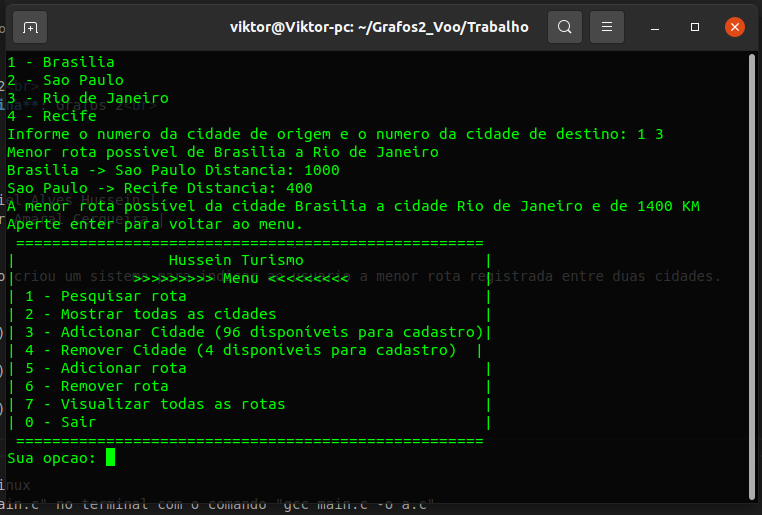
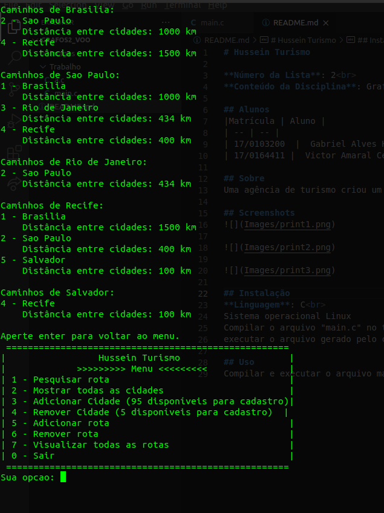
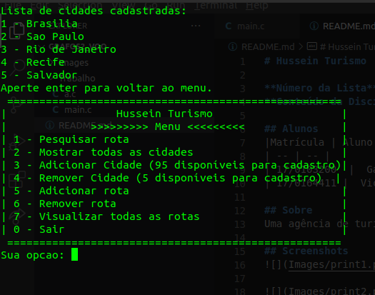

# Hussein Turismo

**Número da Lista**: 2 
**Conteúdo da Disciplina**: Grafos 2 

## Alunos
|Matrícula | Aluno |
| -- | -- |
| 17/0103200  |  Gabriel Alves Hussein |
| 17/0164411 |  Victor Amaral Cerqueira |

## Sobre 
Uma agência de turismo criou um sistema para indicar ao usuario a menor rota registrada entre duas cidades.

## apresentacao

## Screenshots

## Instalação 
**Linguagem**: C 
Sistema operacional Linux
Compilar o arquivo "main.c" no terminal com o comando "gcc main.c -o a.c"
executar o arquivo gerado pelo compilador com o comando "./a.c"

## Uso 
Compilar e executar o arquivo main.c no terminal